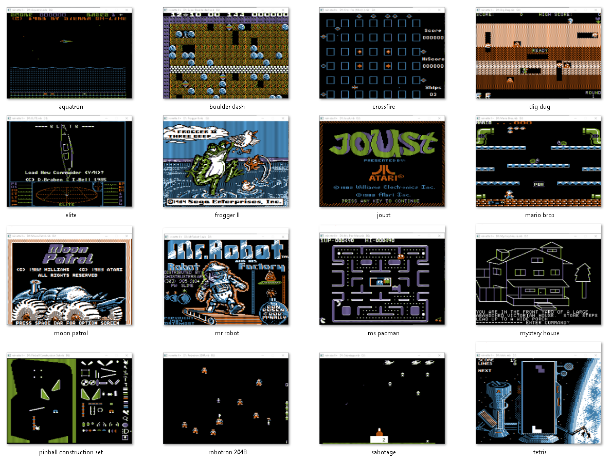

# reinette II plus

### reinette goes graphical !



After [reinette](https://github.com/ArthurFerreira2/reinette) (Apple 1 emulator) and [reinette II](https://github.com/ArthurFerreira2/reinette-II) (the text only Apple II emulator), I am proud to release **reinette II plus**, a French\* Apple II plus emulator using SDL2.

\* reinette has two meanings in French : it's a little frog but also a delicious kind of apple

[download windows binaries](https://github.com/ArthurFerreira2/reinette-II-plus/releases/tag/0.4)

### Featuring :

* all video modes in color
* mono sound with mute/unmute
* 64KB (language card support)
* paddles/joystick with trim adjustment
* paste text from clipboard
* disk ][ adapter with two drives (.nib files only)
* drag and drop .nib files to inset a floppy
* save floppy changes back to host
* screen scaling by integer increments
* easy screenshot


It uses an optimized and accurate MOS 6502 CPU emulator (now christened [puce6502](https://github.com/ArthurFerreira2/puce6502)).\
You only need SDL2 to compile it. (I'm not using SDL_Mixer, but only the native SDL2 audio functions)

This emulator is not accurate in many ways and does not compete with
[AppleWin](https://github.com/AppleWin/AppleWin), [Epple](https://github.com/cmosher01/Epple-II) or [LinApple](https://github.com/linappleii/linapple). Better use one of them if you want a good Apple ][ emulation experience.

I wrote it with the goal to better understand the Apple ][ internals, and I'm publishing the sources in the hope they will be of any help.

It's compact, with two source files only, one for the CPU emulation, the other for the computer itself.

I did my best to comment the code, and if you have an idea of how an Apple ][ works, it should be easy for you to understand the code, modify and enhance it for your needs (see TODO section).

### Startup

  You can specify a .nib file at the command line to start the emulator with a floppy engaged in drive 1. Otherwise, the emulator will start with no floppy (and thus waits until you press the reset key or drag and drop a .nib file)

### Usage

Drag and drop a disk image file (.nib format only) to insert it into drive 1\
**reinette II plus** will reboot immediately and try to boot the floppy.\
Press CTRL while dropping the file if you don't want the emulator to reboot \
Pressing the ALT key while dropping the file inserts it into drive 2.

Use the functions keys to control the emulator itself :
```
* F1       : display save how to
* ctrl F1  : writes the changes of the floppy in drive 0 back to host
* alt  F1  : writes the changes of the floppy in drive 1 back to host
* F2       : save a screenshot into the screenshots directory
* F3       : paste text from clipboard
* F4       : mute / unmute sound
* shift F4 : increase volume
* ctrl  F4 : decrease volume
* F5       : reset joystick release speed,
* shift F5 : increase joystick release speed
* crtl  F5 : decrease joystick release speed,
* F6       : reset joystick action speed,
* shift F6 : increase joystick action speed
* crtl  F6 : decrease joystick action speed,
* F7       : reset the zoom to 2:1
* shift F7 : increase zoom up to 8:1 max
* ctrl  F7 : decrease zoom down to 1:1 pixels
* F10       : pause / un-pause the emulator
* F11      : reset
* F12      : about, help

Paddles / Joystick :

* numpad 1 : left
* numpad 3 : right
* numpad 5 : up
* numpad 2 : down
* CTRL     : button 0
* ALT      : button 1
* SHIFT    : button 2 (allow applications to use the shift mod)
```

### Limitations

* ~~high pitch noise at high volume on windows (Linux Ubuntu tested OK)~~
* ~~sound cracks when playing for long period (intro music for example)~~
* ~~CPU is not 100% cycle accurate - see source file for more details~~
* colors are approximate (taken from a scan of an old Beagle bros. poster)
* ~~HGR video is inaccurate, and does not implement color fringing~~
* ~~disk ][ access is artificially accelerated~~ - considered as a feature
* only support .nib floppy images. (you can use [CiderPress](https://github.com/fadden/ciderpress) to convert your images to this format)
* ~~only has 48KB of RAM (can't run software requiring the language card)~~
* and many others ...

### To do

* ~~fix sound cracks~~
* give a warning if the application exits with unsaved floppy changes
* check for more accurate RGB values.
* ~~implement color fringe effect in HGR~~
* ~~re-implement Paddles and Joystick support for analog simulation~~
* ~~implement the language card and extend the RAM of **reinette II plus** to 64K to support more software.~~
* for 6502 coders :
  * add the ability to insert a binary file at a specified address
  * give the user the option to start with the original Apple II rom
  * dump regs, soft switches and specified memory pages to console

\
\
\
*simplicity is the ultimate sophistication*
